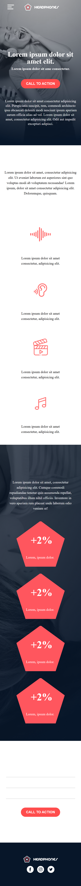

# Headphones - ALX Project

A responsive landing page for a headphones company, built with HTML and CSS as part of the ALX Software Engineering program.

## Preview

### Mobile View


## Features

- Responsive design that works on mobile, tablet, and desktop
- Clean and modern user interface
- Interactive elements with hover states
- Optimized for performance

## Technologies Used

- HTML5
- CSS3 (with CSS Grid and Flexbox)
- Responsive Design Principles

## Project Structure

```
headphones/
├── 0-index.html          # Main HTML file
├── 0-styles.css          # Main stylesheet
├── assets/               # Icons and other assets
│   ├── Facebook_White.png
│   ├── Instagram_White.png
│   ├── Twitter_White.png
│   ├── background.png
│   ├── hearing.png
│   ├── logo.png
│   ├── menu.png
│   ├── music.png
│   └── sound-frecuency.png
├── images/               # Image assets
│   ├── favicon.png
│   ├── logo_headphones.png
│   └── pentagone.png
└── README.md             # This file
```

## Getting Started

1. Clone the repository
2. Open `0-index.html` in your web browser
3. Explore the responsive design by resizing your browser window

## Live Demo

[View Live Demo](#) (Add your live demo link here when available)

## Author

[Your Name]

## License

This project is licensed under the MIT License - see the [LICENSE](LICENSE) file for details